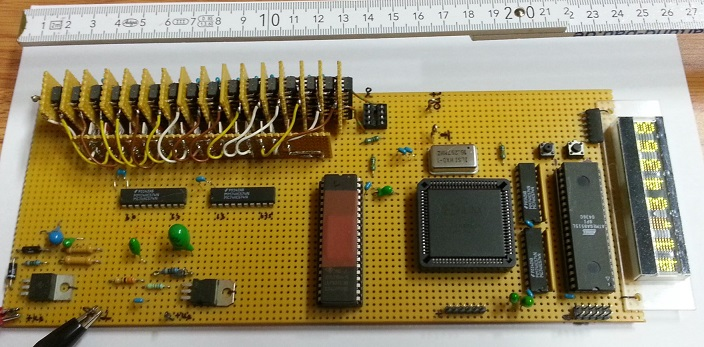

# dds-synth
Direct digital synthesizer (DDS) with ATmega8515, Xilinx XC9572 CPLD and SDA5708-24B display.
This is my home brew hobby DDS synthesizer consisting of different self-made components like
a 16-bit R-2R digital to analog converter (DAC).
Due to design failure in the output driver circutry its output lacks of any low-pass filter,
but it is interesting to see R-2R raw output in action :)

## The board

## ATmega8515
ATmega8515 polls two buttons to increase/decrease frequency status word, computes
resulting frequency and prints it on the display.

## EPROM 27C210-15
The EPROM is a 16-bit x 65536 words one containing full sine wave samples.

## XC9572 CPLD
The Xilinx CPLD implements a 16-bit phase accumulator using frequency status word
provided by the ATmega8515.
It also includes a state machine for proper timings accessing EPROM (27C210-15) and
latching samples for 16-bit DAC.
The base clock of the CPLD is 16.257 MHz. Due to 150 ns access time of the EPROM, the
state machine divides the clock by 6 resulting in 2.7095 Mega-samples per second.
With 16-bit phase accumulator and frequency status word the lowest DDS frequency
step is 41.343689 Hz.

## 16-bit R-2R DAC
Every bit of this DAC has a CMOS 4007 as a line driver, so there are total 16 CMOS
4007 ICs.

## SDA5708-24B display
It is an 8-digit LED matrix display.

